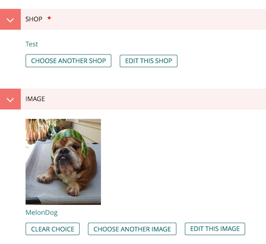
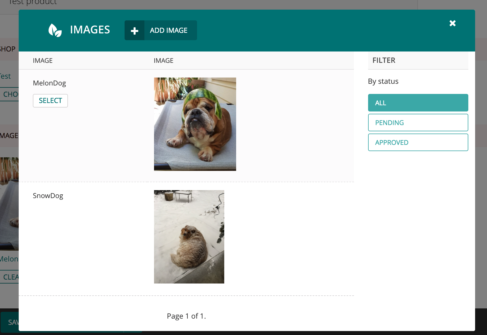
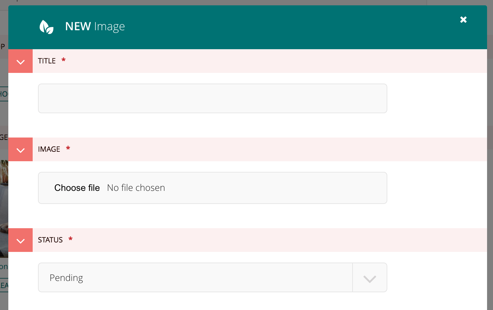
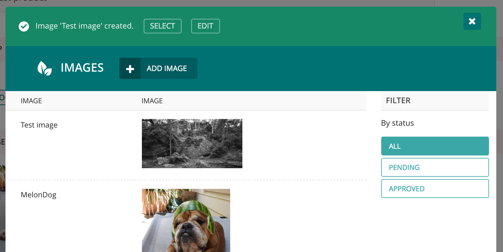

# wagtail-instance-selector

A widget for Wagtail's admin that allows you to create and select related items.

- [Features and screenshots](#features-and-screenshots)
- [Installation](#installation)
- [Documentation](#documentation)
  - [Using the widget as a field panel](#using-the-widget-as-a-field-panel)
  - [Using the widget in a stream field](#using-the-widget-in-a-stream-field)
  - [Customizing the widget's display and behaviour](#customizing-the-widgets-display-and-behaviour)
- [Rationale & Credits](#rationale--credits)
- [Development notes](#development-notes)


## Features and screenshots

### Customizable widget display

By default, widgets appear similar to other Wagtail elements, but they can be customised to include images 
and other items.




### Item selection reuses the admin's list views to ensure consistent UIs with filtering.




### Inline creation

Items can be created within the selection widget.



After creation, items can be selected from the success message or from the list view.




## Installation

```
pip install wagtail-instance-selector
```

and add `'instance_selector'` to `INSTALLED_APPS`.


## Documentation


### Using the widget as a field panel

```python
from django.db import models
from instance_selector.edit_handlers import InstanceSelectorPanel


class Shop(models.Model):
    pass


class Product(models.Model):
    shop = models.ForeignKey(Shop, on_delete=models.CASCADE)

    panels = [InstanceSelectorPanel("shop")]
```


#### Using the widget in a stream field

```python
from django.db import models
from wagtail.admin.edit_handlers import StreamFieldPanel
from wagtail.core.fields import StreamField
from instance_selector.blocks import InstanceSelectorBlock


class Product(models.Model):
    pass


class Service(models.Model):
    pass


class Shop(models.Model):
    content = StreamField([
        ("products", InstanceSelectorBlock(target_model="test_app.Product")),
        ("services", InstanceSelectorBlock(target_model="test_app.Service")),
    ])

    panels = [StreamFieldPanel("content")]
```

To create reusable blocks, you can subclass `InstanceSelectorBlock`.  

```python
from instance_selector.blocks import InstanceSelectorBlock


class ProductBlock(InstanceSelectorBlock):
    def __init__(self, *args, **kwargs):
        target_model = kwargs.pop("target_model", "my_app.Product")
        super(ProductBlock, self).__init__(target_model=target_model, **kwargs)
    
    class Meta:
        icon = "image"
        
# ...

StreamField([
    ("products", ProductBlock()),
])
```


### Customizing the widget's display and behaviour

```python
from wagtail.contrib.modeladmin.options import ModelAdmin, modeladmin_register
from instance_selector.registry import registry
from instance_selector.selectors import ModelAdminInstanceSelector
from .models import MyModel


@modeladmin_register
class MyModelAdmin(ModelAdmin):
    model = MyModel


class MyModelInstanceSelector(ModelAdminInstanceSelector):
    model_admin = MyModelAdmin()

    def get_instance_display_title(self, instance):
        if instance:
            return "some title"

    def get_instance_display_image_url(self, instance):
        if instance:
            return "/url/to/some/image.jpg"
            
    def get_instance_display_image_styles(self, instance):
        # The `style` properties set on the  element, primarily of use
        # to work within style+layout patterns
        if instance:
            return {
                'max-width': '165px',
                # ...
            }
        
    def get_instance_display_markup(self, instance):
        # Overriding this method allows you to completely control how the
        # widget will display the relation to this specific model
        return "<div> ... </div>"
        
    def get_instance_display_template(self):
        # The template used by `get_instance_display_markup`
        return "instance_selector/instance_selector_widget_display.html"
        
    def get_instance_selector_url(self):
        # The url that the widget will render within a modal. By default, this 
        # is the ModelAdmin"s list view
        return "/url/to/some/view/"
    
    def get_instance_edit_url(self, instance):
        # The url that the user can edit the instance on. By default, this is 
        # the ModelAdmin"s edit view 
        if instance:
            return "/url/to/some/view/"


registry.register_instance_selector(MyModel, MyModelInstanceSelector())
```

Note that the `ModelAdminInstanceSelector` is designed for the common case. If your needs
are more specific, you may find some use in `instance_selector.selectors.BaseInstanceSelector`.


## Rationale & Credits

Largely, this is a rewrite of [neon-jungle/wagtailmodelchooser](https://github.com/neon-jungle/wagtailmodelchooser) 
that focuses on reusing the functionality in the ModelAdmins. We had started a large build using wagtailmodelchooser 
heavily, but quickly ran into UI problems when users needed to filter the objects or create them inline. After 
[neon-jungle/wagtailmodelchooser#11](https://github.com/neon-jungle/wagtailmodelchooser/issues/11) received little 
response, the decision was made to piece together parts from the ecosystem and replicate the flexibility of 
django's `raw_id_fields`, while preserving the polish in Wagtail's UI.

Much of this library was built atop of the work of others, specifically: 
- https://github.com/neon-jungle/wagtailmodelchooser
- https://github.com/springload/wagtailmodelchoosers
- https://github.com/Naeka/wagtailmodelchooser


## Development notes


### Run tests

```
pip install -r requirements.txt
python runtests.py
```


### Formatting

```
pip install -r requirements.txt
black .
```
